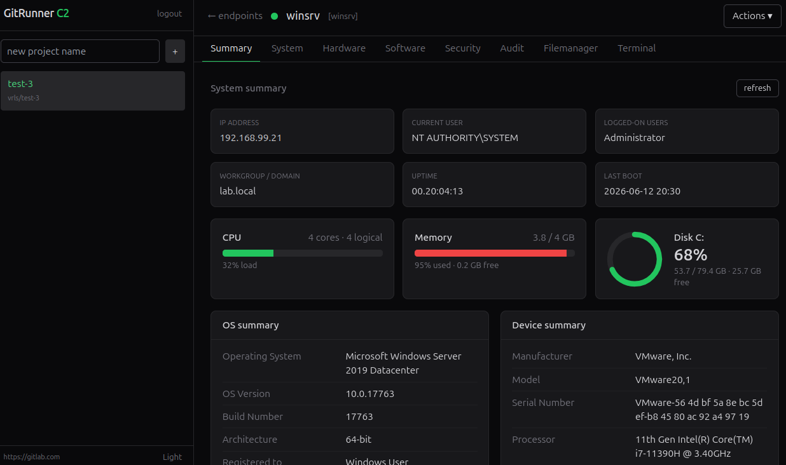

# GitRunner C2

A **backend-free** endpoint management platform built on GitLab CI. A Vue SPA
talks directly to the GitLab REST API — GitLab is the job queue, log store, and
database. No custom server, no agent beyond `gitlab-runner.exe`.

- Endpoints are self-hosted GitLab Runners (one unique tag each)
- Operations run as CI jobs routed to a runner by tag
- A thin NGINX/Vite proxy handles CORS — nothing else runs server-side



## Prerequisites

**Operator:** A GitLab account (cloud or self-hosted) and a Personal Access Token with `api` scope.

**Endpoint:** Windows (Server or Desktop), internet access to your GitLab instance, and administrator privileges to install `gitlab-runner` as a service.

## How it works

1. Create a project in the UI.
2. Enroll an endpoint — the UI creates a runner and gives you a PowerShell
   one-liner to install and register `gitlab-runner` as a Windows service.
3. Open the endpoint. Every action triggers a CI job on that runner; output is
   read back from the job trace. `GIT_STRATEGY: none` means no `git.exe` is
   needed on the endpoint.

File uploads (drivers, arbitrary files) stage through the GitLab Generic Package
Registry and are pulled by the runner via `CI_JOB_TOKEN` — no extra credentials.

## Features

| Tab | What you get |
|-----|-------------|
| **Summary** | Host facts, CPU/RAM/disk at a glance |
| **System** | Services, Users, Groups, Named Pipes, Drivers, Task Scheduler, Task Manager — all with per-row actions |
| **Hardware** | BIOS, motherboard, CPU, RAM, disks, network adapters |
| **Software** | Installed programs with one-click uninstall |
| **Security** | AV/EDR detection (30+ products, service + named pipe), firewall profiles, BitLocker |
| **Events** | Application, Security, and System event logs — click any row to expand the full message |
| **File Manager** | Browse the filesystem, upload and download files |
| **Terminal** | Remote PowerShell and CMD shell |

**Actions menu:** restart, shutdown, or unenroll an endpoint from the project.

Data is cached per endpoint — switching tabs is instant after the first load.

## Running

**Dev**
```bash
npm install
npm run dev    # http://localhost:5173
```

**Docker**
```bash
docker compose up --build   # http://localhost:8080
```

For a self-hosted GitLab instance, copy `.env.example` to `.env` and set `GITLAB_URL` before running.

## Code structure

```
src/
  api/gitlab.ts        GitLab REST client + managed CI pipeline
  lib/jobs.ts          Trigger, poll, and parse job output
  lib/tabs.ts          Declarative tab/subview definitions
  lib/av.ts            AV/EDR product database (client-side detection)
  lib/inventory.ps1    One-shot endpoint inventory collector
  components/endpoint/ Endpoint UI (DataTab, Drivers, TaskScheduler, …)
```

## Future ideas

- Support for other CI platforms (GitHub Actions, Azure DevOps)
- Linux runner support
- Custom transport backend (swap `gitlab.ts` for a lightweight custom server)

---

## Disclaimer

This tool is intended to be used on authorized endpoints only. The author is not
responsible for misuse, unauthorized access, data loss, system instability, or
any other damage arising from the use of this software. Use at your own risk.
